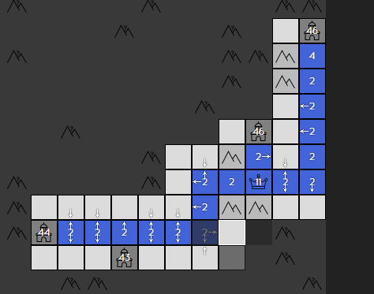

## ⚠ 前排提醒 ⚠

这个扩展并非咱 `cxzlw` 开发，现在似乎已经失效，并且咱暂时没有接手开发的计划，建议使用其它扩展。

其最初作者 `AstralLing` 已从 GitHub 销号，这个仓库才从 fork 转为单独仓库。

AstralLing 销号真的很突然，TA 曾经还做过一个项目 [AstralLing/MMPI2](https://github.com/AstralLing/MMPI2)，源码被 [MMPI-CHN/MMPI-CHN.github.io](https://github.com/MMPI-CHN/MMPI-CHN.github.io) 使用，咱是在看到这个仓库后才意识到 TA 的销号

感谢原作者的贡献，这个仓库会被保留作为 TA 存在的一缕证明。

## A generals.io Game Helper

这是一个浏览器扩展插件，提供一些 generals.io 的辅助功能。

目前采用了 TypeScript 编写后编译成 JavaScript 浏览器扩展的方案，为了避免 commit 记录过于混乱，暂时取消了 js 目录的同步，仓库 `src` 目录下为 ts 源码。

对于开发调试，clone 此仓库后编译 ts 代码，整个仓库目录即可作为插件目录直接导入基于 chromium 的浏览器。

## 功能

未打 √ 的为计划中内容~

- [x] 记录城市和其他玩家皇冠的位置
- [x] 推断其他玩家占有城市数量
- [x] 统计其他玩家本回合兵力增减
- [x] 推断当前正在作战的玩家
- [x] 计算一支队伍的总星数
- [ ] 提前标记自定义地图的城市位置与兵力
- [x] 自动向外扩展领土
- [ ] 自动执行 BFS
- [ ] 计算并显示到达某位置的最短路径
- [ ] 额外的 UI

## 如何使用

- 安装

  - 对于 Chrome 和 Edge

    - 在 release 中下载标有 `-chromium` 的压缩包
    - 解压得到插件文件夹
    - 进入浏览器扩展管理界面，开启开发者模式
    - 选择 `加载已解压的扩展程序`
    - 导入插件文件夹

  - 对于 Firefox

    > Firefox 尚未支持 manifest v3，且因未知原因对 manifest v2 同样报错。这只是一个临时解决方案，它看起来可以勉强正常运行。

    - 在 release 中下载标有 `-firefox` 的压缩包
    - 进入浏览器扩展管理界面
    - 选择 `调试扩展程序`
    - 导入插件压缩包

  - 对于其他浏览器

    没有测试，理论上使用 chromium 内核的都可以正常运行此插件。

- 使用

  - 只要加载了插件，功能中的前五项就会自动生效
  - 按 <kbd>B</kbd> 会自动向所有**可直接扩展的**格子扩展一格。这只会在你领地的边界格生效。

## 注意事项

这个插件并不提供“额外的”作弊功能，例如增加你的兵力、提升你的移动速度等；然而，在使用前，你仍然应该知道 generals.io 并不认可此类辅助插件。

目前显示辅助信息的方案是直接覆盖页面（[轮子](https://github.com/bshu2/generals-io-helper)），这显然有许多缺陷，后续有精力的话会尝试更改插件的显示方案 ( •̀ ω •́ )✧

## 预览图

版本为 1.3.0。

~~谴责谷歌对所有开发者账号收费的行为~~
