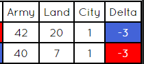
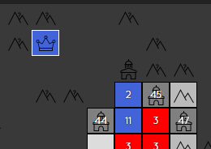

## A generals.io Game Helper

这是一个浏览器扩展插件，提供一些 generals.io 的辅助功能。由于一些众所周知的原因，暂时没有把它上传至浏览器扩展商店的计划。

## 功能

- [x] 记录城市和其他玩家皇冠的位置  
- [x] 推断其他玩家占有城市数量  
- [x] 统计其他玩家本回合兵力增减  
- [x] 推断当前正在作战的玩家  
- [x] 计算一支队伍的总星数  
- [ ] 提前标记自定义地图的城市位置与兵力  
- [ ] 计算并显示到达某位置的最短路径  
- [ ] 额外的 UI

## 注意事项

这个插件并不提供“额外的”作弊功能，例如增加你的兵力、提升你的移动速度等；它只是更好地利用了当前已知的信息。然而，在使用前，你仍然应该知道 generals.io 并不认可此类辅助插件。

目前显示辅助信息的方案是直接覆盖页面（[轮子](https://github.com/bshu2/generals-io-helper)），后续有精力的话会尝试更改插件的显示方案 ( •̀ ω •́ )✧

> 上方链接中的插件已不可用。

## 已知问题

- [ ] 在双方交战时，城市数量推断不准确
- [ ] 暂不支持显示组队时队伍间的交战情况

## 如何使用

### 对于 Chrome 和 Edge

- 在 release 中下载标有 `-chromium` 的压缩包
- 解压得到插件文件夹
- 进入浏览器扩展管理界面，开启开发者模式
- 选择 `加载已解压的扩展程序`
- 导入插件文件夹

### 对于 Firefox

> Firefox 尚未支持 manifest v3，且因未知原因对 menifest v2 同样报错。这只是一个临时解决方案，它看起来可以勉强正常运行。

- 在 release 中下载标有 `-firefox` 的压缩包
- 进入浏览器扩展管理界面
- 选择 `调试扩展程序`
- 导入插件压缩包

### 对于其他浏览器

没有测试，理论上使用 chromium 内核的都可以正常运行此插件。

## 预览图

版本为 1.2.1。

